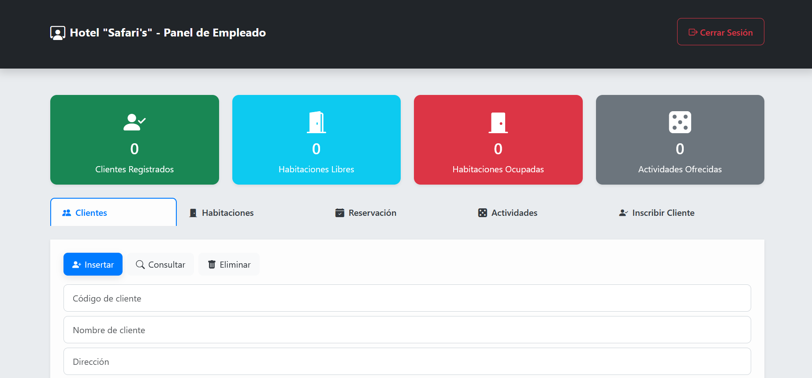

# Sistema de Gestión Hotelera "Safari's" 🏨

# Autor: [Imanol]

# Fecha: [8 de septiembre del 2025 ]


Este es un sistema de gestión para hoteles, desarrollado originalmente como un proyecto universitario y posteriormente refactorizado y modernizado por completo para seguir las mejores prácticas de seguridad y desarrollo web actuales. La aplicación permite manejar las operaciones diarias de un hotel, con roles de usuario diferenciados para administradores y empleados.

---

## ✨ Características Principales

- **Control de Acceso Basado en Roles:** Dos niveles de permiso (`Administrador` y `Empleado`) con paneles y funcionalidades personalizadas.
- **Dashboard con Estadísticas:** Vistas generales y operativas con datos clave como número de empleados, clientes, y estado de las habitaciones.
- **Gestión de Empleados (CRUD):** El administrador puede crear, ver, editar y eliminar cuentas de empleados, incluyendo la asignación de roles.
- **Gestión de Operaciones:** El personal puede gestionar Clientes, Habitaciones, Reservas y Actividades ofrecidas por el hotel.
- **Lógica de Negocio Automatizada:** El sistema actualiza automáticamente la disponibilidad de una habitación al crear o eliminar una reserva.
- **Seguridad Robusta:**
  - Protección contra Inyección SQL mediante el uso de **PDO y Sentencias Preparadas**.
  - Almacenamiento seguro de contraseñas utilizando **hashing con `password_hash()`**.
  - Protección de páginas por rol de sesión.
- **Experiencia de Usuario Moderna (AJAX):** Funcionalidades asíncronas con la **API Fetch** para eliminar registros sin necesidad de recargar la página.

---

## 🛠️ Tecnologías Utilizadas

### Frontend

- HTML5
- CSS3 (con Variables CSS para fácil personalización)
- **Bootstrap 5** para un diseño responsivo y moderno.
- **JavaScript (ES6+)** para la interactividad y llamadas a la API (`Fetch`).

### Backend

- **PHP 8+**
- **PDO (PHP Data Objects)** para una conexión segura a la base de datos.
- **MySQL / MariaDB** como motor de base de datos.
- Arquitectura de API simple para las operaciones del backend.

---

## 📸 Vistas Previas




---

## 🚀 Instalación y Puesta en Marcha

Sigue estos pasos para ejecutar el proyecto en un entorno local (como XAMPP o WAMP).

1.  **Prerrequisitos:**

    - Tener un servidor local como XAMPP o WAMP instalado, con Apache y MySQL en funcionamiento.
    - Tener acceso a un gestor de bases de datos como phpMyAdmin.

2.  **Clonar el Repositorio:**

    ```bash
    git clone [https://github.com/Imaforbes/Hotel-Safaris.git](https://github.com/Imaforbes/Hotel-Safaris.git)
    ```

    O simplemente descarga y descomprime el archivo ZIP en tu carpeta `htdocs` (para XAMPP) o `www` (para WAMP).

3.  **Configurar la Base de Datos:**

    - Abre phpMyAdmin.
    - Crea una nueva base de datos llamada `hotel`.
    - Selecciona la base de datos `hotel`, ve a la pestaña **Importar** y sube el archivo `hotel.sql` que se encuentra en el proyecto.

4.  **Configurar la Conexión:**

    - Abre el archivo `api_hotel/conexion.php`.
    - Si tu base de datos tiene una contraseña, modifícala en la variable `$pw`.

5.  **Ejecutar:**
    - Abre tu navegador y ve a `http://localhost/hotel/` (o el nombre de la carpeta de tu proyecto).

---

## 🧑‍💻 Uso

Una vez configurado, puedes acceder al sistema con las credenciales de administrador por defecto:

- **Usuario:** `admin`
- **Contraseña:** `admin123`

Desde el panel de administrador, podrás crear nuevas cuentas de empleado para probar los diferentes roles.
